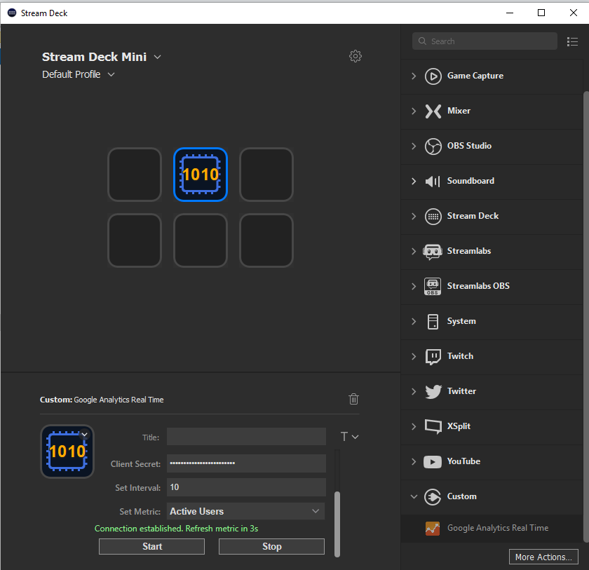

`Google Analytics Real Time` is a Stream Deck plugin that makes use of the Google Analytics Real Time API to enable you monitoring your site.

# Description

Google Analytics's Real Time Reporting API enables you to request real time data—for example, real time activity on your property—for an authenticated user. This plugin makes use of the API to display active viewers currently on your site.

# Features

- Display active viewers

# Installation

In the Release folder, you can find the file `com.mel.googleanalytics.streamDeckPlugin`. If you double-click this file on your machine, Stream Deck will install the plugin.
